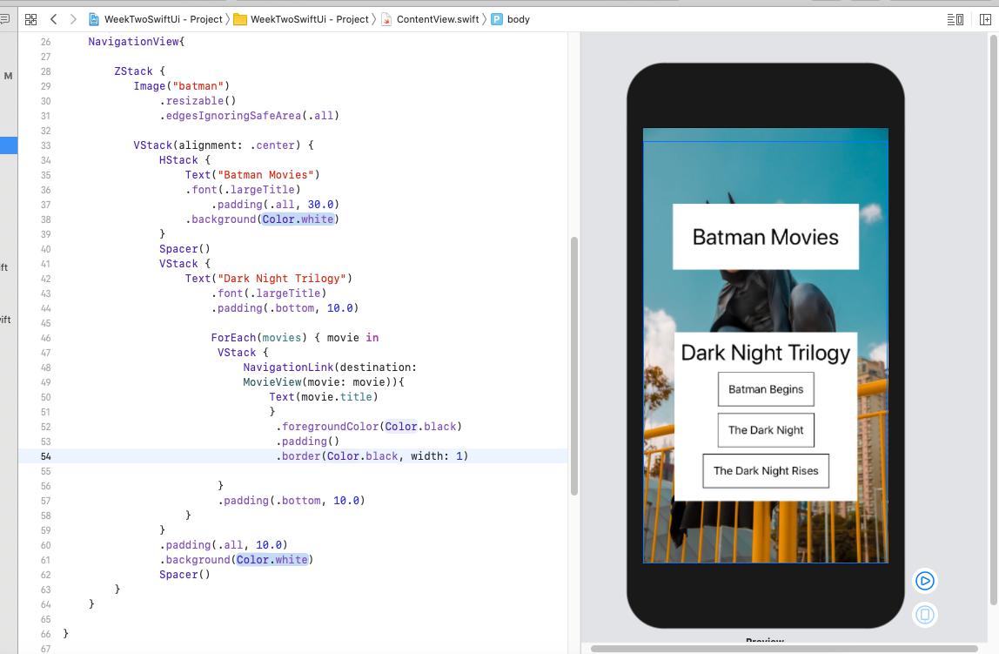
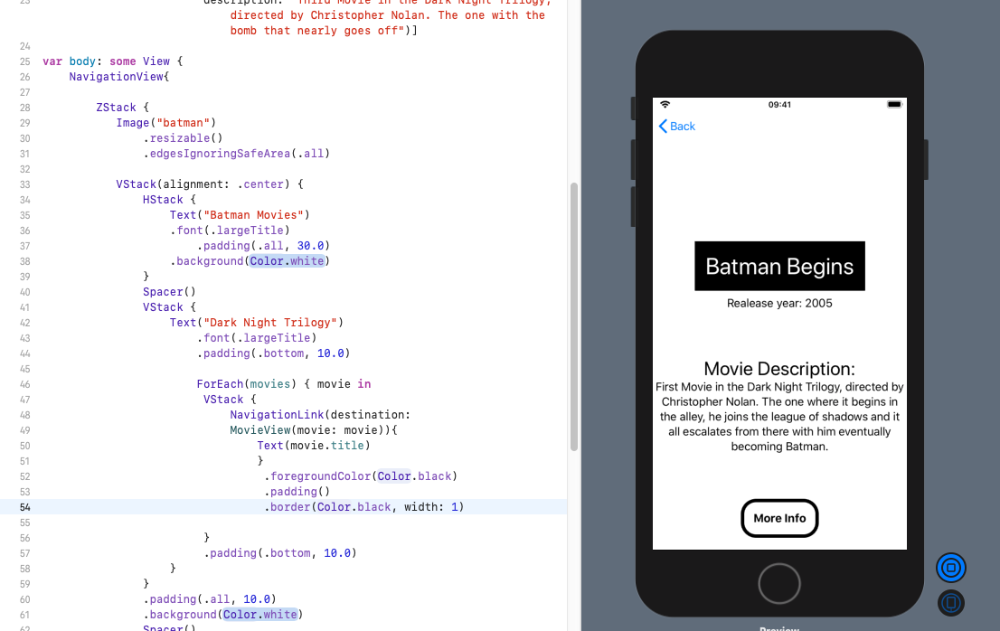

# Week 2 - Swift Course

### Looping in Swift

Here we are looping over a normal array, looks pretty standard

var movies = ["movie 1", "movies 2"]
ForEach(0..< movies.count) { number in
	Text(movies[number])
}

### Moving to new screen: NavigationLink(destination: "here")

Important to wrap this in a NavigationView ** that was a bug for a while!

To move to  new screen we use the navigationLink syntax.
The destination must be a file which we create, in this case its name is MovieView.
MovieView requires a title which we are passing it so the component will properly load.

ForEach(0..< movies.count) { number in
	NavigationLink(destination:
     MovieView(title: movie[number])) {
     	Text(movie[number])
 }

Now MovieView requires a movie object.
A movie object is created in another file - Movie.swift

  ForEach(movies) { movie in                  
                        NavigationLink(destination:
                                MovieView(movie: movie)) {
                                Text(movie.title)
                        }

### Using the Ternary operator

Can use the ternary operator just like in React.

		Toggle(isOn: $isLiked) {
                Text("Do you like this film?")

            }
        }
        .background(isLiked ? Color.red : Color.green)

### Using System Icons

Used this to get the message symbol, this is where we got them from.

https://developer.apple.com/design/human-interface-guidelines/sf-symbols/overview/

  .tabItem {
                Image(systemName: "message")
                Text("Movies")
            }

### Thoughts and questions

- Having to string interpolate ints was a bit strange I thought.

- Can buttons be used to go to navigation views?  Does not seem like it.

- Tried to do an image overlay for the home page but it did not work.  Found that tricky to work out.

- Error messages can be unhelpful!

- The modifiers assistance is very helpful.

- Sorting out spacing seems to get it working sometimes...
